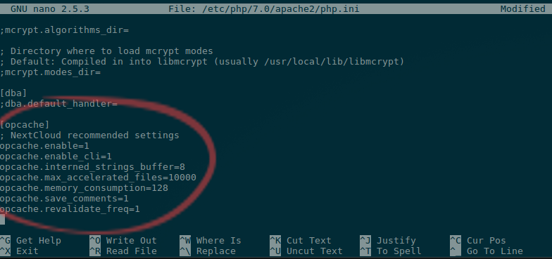

# How To Install NextCloud Server
****
## Install Guide for Ubuntu 16.04

The original blog post and link to YouTube video is located here: [TheNerdGarden](https://www.thenerdgarden.com/a-cloud-of-our-own-nextcloud/)

## Know Before You Load

Before you start your install you will need:

1. A PC or Server running Linux. This machine will need to be running all the time in order
to manage your cloud.
3. A terminal that you can use to connect to the Linux machine will house your NextCloud
install.
    * If you are using Windows, PuTTY is a fantastic program to remote via ssh into
Linux systems.
    * My favorite, Linux, and also OSX, both already include a built-in terminal.
2. A LAMP stack (Linux, Apache, MySQL, PHP) installed and configured on your
Linux machine. NextCloud recommends using MariaDB over MySQL.

## Install LAMP stack (recommended)
Apache2, MariaDB, PHP 7.0
You can follow my guide to install the [LAMP stack on Ubuntu 16.04](ubuntu_LAMP.md)

***
## Install LAMP via tasksel (quicker but uses MySQL)
Apache2, MySQL, PHP 7.0
    * In your terminal, enter:
```bash
sudo tasksel
```
    * Then select LAMP server from the menu.
    * Click on OK
```bash
sudo apt-get install php7.0-zip php-curl
```
***
## Create a Database and User In MySQL

1. You will be prompted to enter the password for the root user of MySQL
```bash
sudo mysql -u root -p
```
2. In your terminal enter the command below. You can adjust them to the database , user
and password that you wish to use. Here my database is called 'tngcloud', the user is 'tngcloud' and the password is 'elvisthepug'
```sql
CREATE DATABASE tngcloud;
GRANT ALL PRIVILEGES ON tngcloud.* TO "tngcloud"@"localhost" IDENTIFIED BY "elvisthepug";
FLUSH PRIVILEGES;
\q
```

## Download The NextCloud Server

1. In your terminal enter the command below.
```bash
wget https://download.nextcloud.com/server/releases/nextcloud-12.0.0.zip
```
2. Next, enter the command to unzip and copy NextCloud to your webserver.
```bash
unzip nextcloud-12.0.0.zip 
sudo cp -r ./nextcloud /var/www/html/ 
sudo chown -R www-data:www-data /var/www/html/nextcloud
```

## Run the NextCloud setup wizard

1. Using a web browser point to your webserver’s URL and /nextcloud. Our example it is http://thenerdgarden/nextcloud

2. Enter an admin user name and password.
3. Enter the database name, database password, and the database user that you created earlier.

4. Awesome, Dude! The NextCloud server install is complete!

****
# Secure and Optimize NextCloud
****
## Relocate the Data Directory
By default the data files are stored inside the web serverpath at nextcloud/data. It is a good idea and recomended by NextCloud to move this directory outside of the web server root.

1. Decide where to relocate the data directory. I like to store mine in /home simply because I already have scheaduled backups running for all data in my /home partition. I'll relocate my nextcloud data to /home/nextcloud/data.
2. Create the new directory
```bash
sudo mkdir -p /home/nextcloud
```
3. Move the data directory from the default location:
```bash
cd /var/www/html/nextcloud
sudo mv ./data /home/nextcloud/
```
4. Check that the new data directory owner and group is www-data www-data.
```bash
sudo ls -lh /home/nextcloud/data/
```
If it's not. Set the permissions with.
```bash
sudo chow -R www-data:ww-data /home/nextcloud/data
```
5. Edit the nextcloud conf.php to point to the new data location.
```bash
sudo nano /var/www/html/nextcloud/config/config.php
```
Find the line that has   'datadirectory' => '/var/www/html/nextcloud/data',
Change the directory to your new location /home/nextcloud/data


****
## Configure NextCloud with HTTPS
```bash
sudo a2enmod ssl
sudo a2ensite default-ssl.conf

sudo touch /etc/apache2/sites-available/redirect-tng-ssl.conf

sudo nano /etc/apache2/sites-available/redirect-tng-ssl.conf
```
Adjust the code below for your servername an paste it into redirect-tng-ssl.conf to create a permanent redirect to https for your servername.
This will redirect everyting coming into this server name to https so if you already have other sites running make sure check if they will work with htts before making this change.
```
<VirtualHost *:80>
   ServerName thenerdgarden
   Redirect permanent / https://thenerdgarden/
</VirtualHost>
```
```bash
sudo a2ensite redirect-tng-ssl.conf
```
Reload apache
```bash
sudo systemctl reload apache2.service
```
****
## Enable HSTS
In the admin settings you will see the below message: Lets enable it.
> The "Strict-Transport-Security" HTTP header is not configured to at least "15552000" seconds. For enhanced security we recommend enabling HSTS as described in our security tips.

```bash
sudo nano /etc/apache2/sites-available/default-ssl.conf

```
Add the below code to default-ssl.conf 
```
                #set Strict-Transport-Security per NextCloud recommended doc
                <IfModule mod_headers.c>
                  Header always set Strict-Transport-Security "max-age=15552000; includeSubDomains"
                </IfModule>
```


Enable headers module
```bash
sudo a2enmod headers
```
Reload apache
```bash
sudo systemctl reload apache2.service
```
****
## Enable PHP Opcache
NextCloud recommends enabling PHP Opcache for performance.

```bash
sudo nano /etc/php/7.0/apache2/php.ini
```
Add the below lines to the php.ini file just under \[opcache\]
```
; NextCloud recommended settings
opcache.enable=1
opcache.enable_cli=1
opcache.interned_strings_buffer=8
opcache.max_accelerated_files=10000
opcache.memory_consumption=128
opcache.save_comments=1
opcache.revalidate_freq=1
```


Reload apache
```bash
sudo systemctl reload apache2.service
```

****
## Configure Memory Cache (optional)
NextCloud recommends configureing memcache for performance.
### Redis Cache
```bash
sudo apt install redis-server

sudo apt install php-redis

sudo nano /var/www/html/nextcloud/config/config.php
```
Add the below lines at the end of the file just before );

```
  'memcache.distributed' => '\OC\Memcache\Redis',
  'memcache.local' => '\OC\Memcache\Redis',
  'memcache.locking' => '\OC\Memcache\Redis',
  'redis' => array(
       'host' => 'localhost',
       'port' => 6379,
       ),
```


****
## Credits
* https://www.linuxbabe.com/cloud-storage/setup-nextcloud-server-ubuntu-16-04-apache-mariadb-php7
* https://docs.nextcloud.com/server/12/admin_manual/installation/index.html
* https://docs.nextcloud.com/server/12/admin_manual/configuration_server/server_tuning.html
