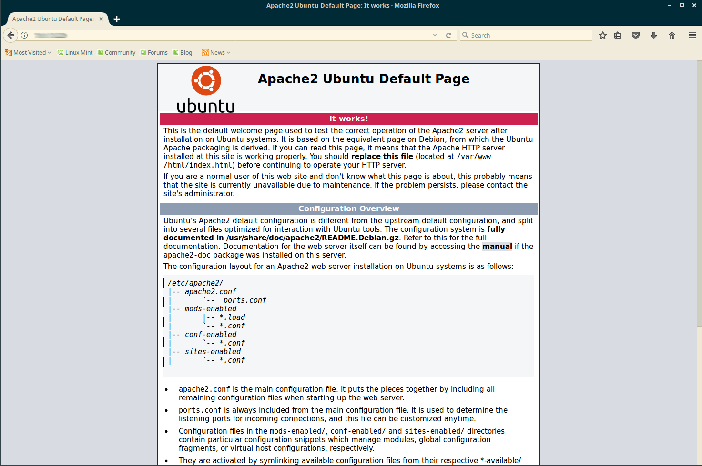
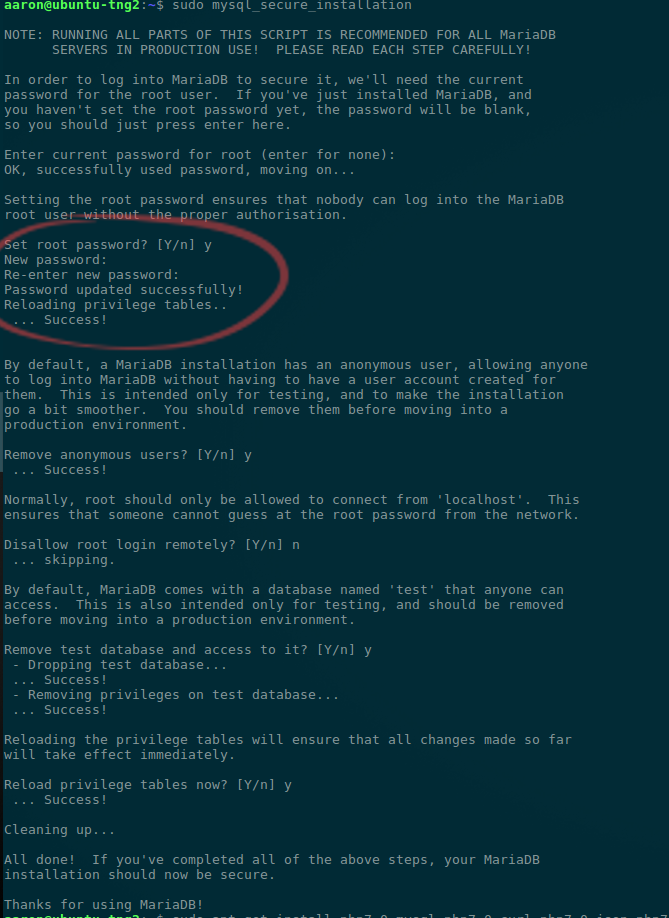
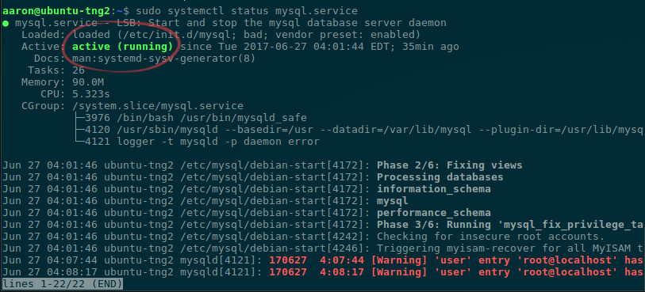
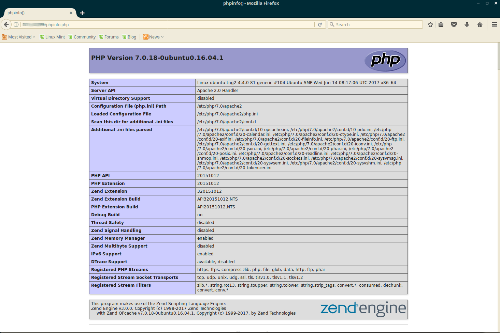
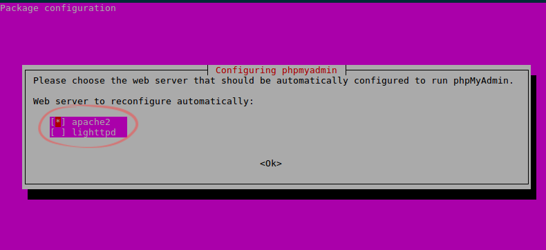
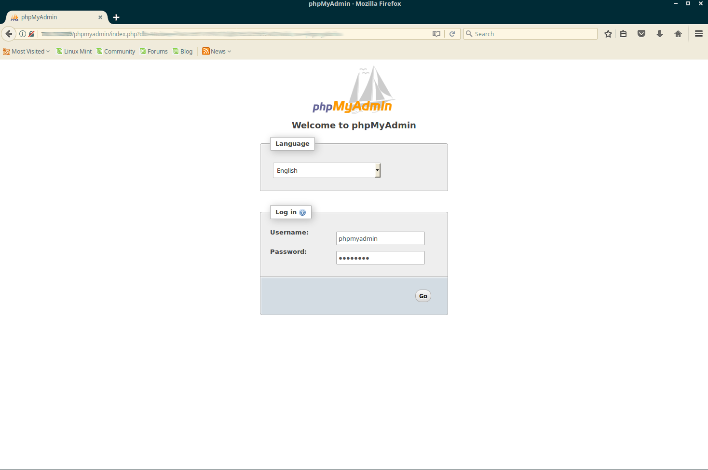

# How to set up LAMP on Ubuntu 16.04 LTS for NextCloud
****
Our **LAMP** stack will be **Ubuntu 16.04**, **Apache2**, **MariaDB**, **PHP 7.0**

****
## Install Apache2

```bash
sudo apt-get install apache2
```
verify you can connect to apache

in a web browser enter your ip address or server name

```
http://<ip address>/
```


****
## Install MariaDB
```bash
sudo apt-get install mariadb-server
```

```bash
mysql_secure_installation
```
Folow the prompts to secure your your mysql(mariadb) install

The initial password is blank. Hit the enter key to continue then 'y' to set the password.

Answer the rest of the questions as you wish.



Verify MariaDB is running
```bash
sudo systemctl status mysql.service
```


****
## Install PHP
```bash
sudo apt-get install php7.0-mysql php7.0-curl php7.0-json php7.0-cgi php7.0 libapache2-mod-php7.0 php7.0-zip php-curl 
```


Create as root

```bash
echo '<?php phpinfo(); ?>' | sudo tee /var/www/html/phpinfo.php
```

in a web browser

```
http://<ip address>/phpinfo.php
```



****
## Install phpMyAdmin (optional)
Use phpMyAdmin to manage your databases via a web browser.

```bash
sudo apt-get install phpmyadmin
```
Choose apache2



in a web browser

```
http://<ip address>/phpmyadmin
```


****
## Credits
* http://www.unixmen.com/how-to-install-lamp-stack-on-ubuntu-16-04/
* https://www.linuxbabe.com/cloud-storage/setup-nextcloud-server-ubuntu-16-04-apache-mariadb-php7
